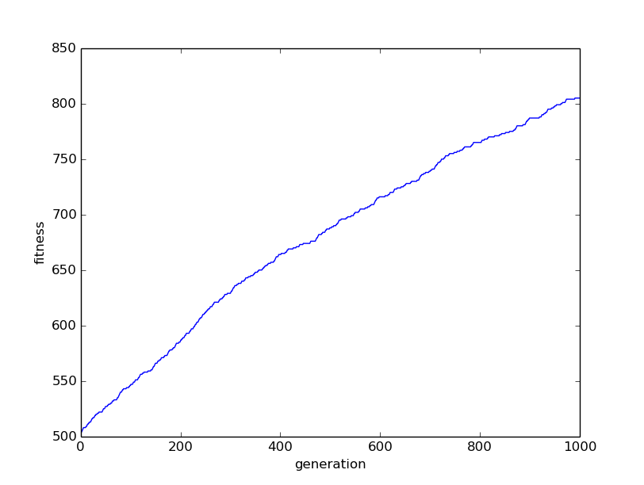

metaheuristicks
===============
##Usage
python Experiment.py  -h

-r :Generate Array length

-t :Select the number of generations

-l :Tabu list length ,the parameter is required if adopt Tabu Search

-T :Initial temperature ,the parameter is required if adopt Simulated Annealing

-q :Population quantity ,the parameter is required if adopt Genetic Algorithm

-c :Crossover probability recommend 0.6 ~ 0.8

-m :Mutation probability recommend 0.01

--HC :run 'Hill Climbing'

--TS :run 'Tabu Search'

--SA :run 'Simulated Annealing'

--GA :run 'Genetic Algorithm'

Usage : python Experiment.py -r 10 -t 10 --HC

Usage : python Experiment.py -r 10 -t 10 -l 7 --TS

Usage : python Experiment.py -r 10 -t 10 -T 100 --SA

Usage : python Experiment.py -r 10 -t 10 -q 4 -c 0.75 -m 0.01 --GA

